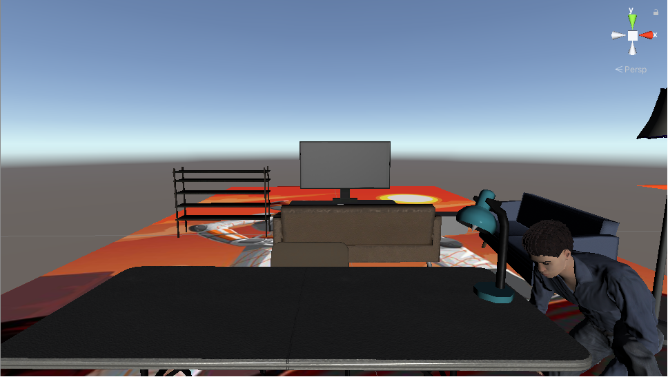
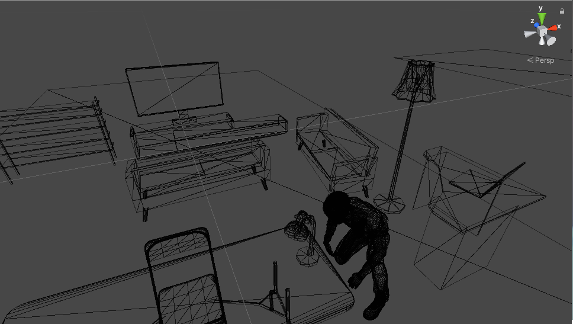
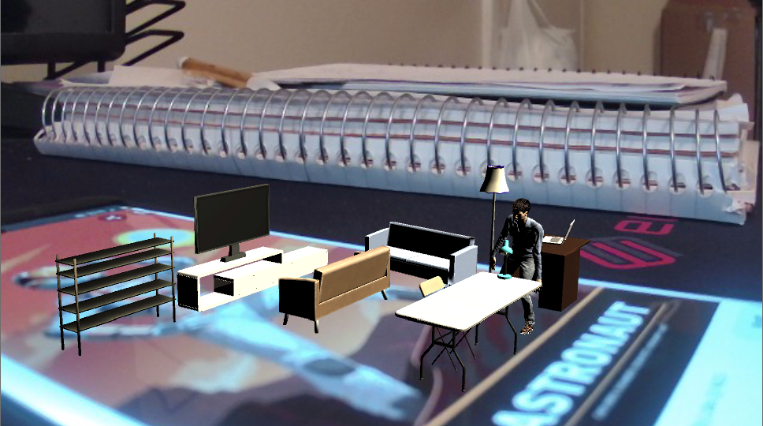

## CS 428: Project 2

### Intro

I decided to model my Project 2 after a mock living room similar to my own. To achieve this I have used the assets listed below to bring the room to life. The room in the playset isn't an exact replica of mine per se, but the premise is all the same. In addition to the playsets featuring my room, I also incorporated a physics playset with solid objects for the user to test the solidity of the objects.

### Steps

1.	Download UnityHub from unity3d.com (Optional)
2.	Download and install Unity Version 2019.4.1f1
3.	Download Vuforia Augmented Reality Engine Package Version 9.4.6 from developer.vuforia.com
4.	Either print or download the Vuforia Mars Markers and ground plane
5.	Download the project from https://github.com/lloydm9/CS428Project2
6.	Use the markers to adjust the widgets if you wish, and that’s basically it
7.	The basic playset is the astronaut
    The life size playset is the Vuforia Ground Plane
    The drone marker is the physics playset

### External Assets

All objects in the project are not my own work, and the links to their pages can be found here. The only thing of my creation in this project is the ambient noise which I recorded on my phone. 

Lamp Pack: https://assetstore.unity.com/packages/3d/props/interior/lamps-pack-19102

Foldable Table and Chair: https://assetstore.unity.com/packages/3d/props/furniture/folding-table-and-chair-pbr-111726

Angular Table: https://assetstore.unity.com/packages/3d/props/furniture/table-angular-164855

Laptop: https://assetstore.unity.com/packages/3d/props/electronics/hq-laptop-computer-42030

Sofas: https://assetstore.unity.com/packages/3d/props/furniture/modern-minimalist-sofa-136398

TV Stand: https://assetstore.unity.com/packages/3d/props/electronics/tv-furniture-60122

Flatscreen TV: https://assetstore.unity.com/packages/3d/props/electronics/flatscreen-tv-9721

Shelf: https://assetstore.unity.com/packages/3d/props/interior/shelf-646

### GitHub
Link:https://github.com/lloydm9/CS428Project2

### Discussion

I feel like these kinds of playsets won’t be immediately popular in a few years, but they’ll be something that people can use. The main concern is would a person be comfortable inputting their height and their weight to be stored so that it can generate a virtual/augmented reality version of themselves. If they wish to further incorporate their likeness they could take a picture so another program could render their face. I believe the average person will not want to take the time to configure a makehuman of themselves. That aside, if people have the technology available to them, I can definitely see them using it. This technology could be applied in the form of an app, where if someone wants to plan out how they will utilize an empty room and they want to see if they have enough space. They would be able to choose between the miniature room and the life size one for their convenience. In both cases they would be able to see themselves animated and doing things such as walk around and if they wish to place a lot of things in a particular room, they could see their virtual avatar try to interact with them. For example, if they have a small room but wish to use it as a construction room where they would be cutting wood, 3D printing, painting, or doing car body touchups/repairs and things of that nature, they would not have a lot of space to place all of those things. This would help them use that space most efficiently, and would also allow them to see if any of the objects conflict with each other and themselves. They would be able to see their animated avatar walk through and use some of the tools and machinery, and observe how the physics works. They could see themselves cutting wood and notice that the excess gets on the 3D printer, so they could try to move it further away. Or if they wish they could use the life size version and walk around to get a more accurate estimation and grasp of how much space they have, and they could do things such as extend their arms to see if it collides with any object. The small figure could be good for figuring out a layout, and the life size would be helpful for refining it and optimizing practicality. This application will be niche but it can have its uses and users. I don’t think children in particular would want to play with a figure that looks like them, however there will be some that for sure would. At the least they would be fascinated by it. I believe that another good application of this could be for sports. Athletes such as runners could run indoors (as there’s too many outside factors for an outside track) and race a virtual version of themselves and see how they compare to help themselves improve. Boxers could use it to shadow box and spar with themselves, and potentially experiment to find their own weaknesses such as those in their form or their speed and they could train to reduce them. The possible applications are endless, however as I said before I don’t think it will be immediately popular, but a niche that people can get more than they think out of. 

### Screenshots

